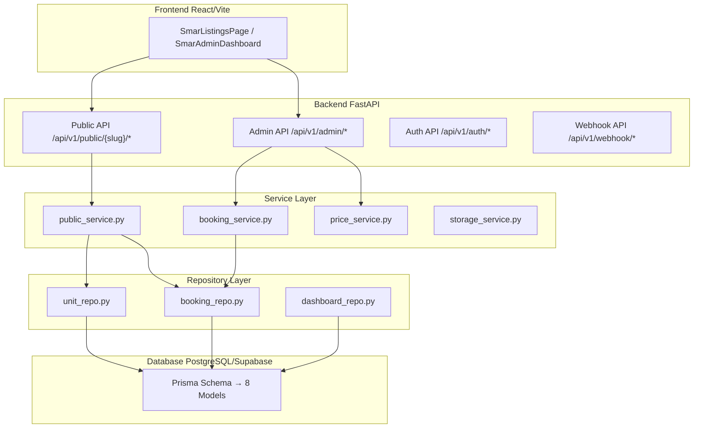
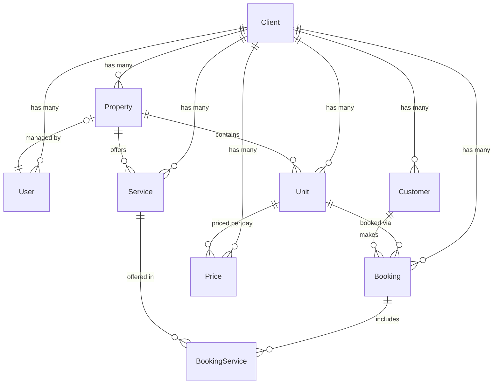

# 📊 تقرير شامل عن قاعدة البيانات — Beit Smar PMS
**تاريخ التقرير:** 20 أبريل 2026  
**التقنيات:** PostgreSQL (Supabase) + Prisma ORM (Python Client) + FastAPI

---

## 🏗️ البنية العامة (Architecture Overview)



**البنية المعمارية ذات الأربع طبقات (4-Layer Architecture):**
- **Routes** → **Services** → **Repositories** → **Database**
- كل استعلام يمر عبر `clientId` لضمان عزل البيانات بين المستأجرين (Multi-Tenancy)

---

## 📋 الجداول الحالية (8 Models)

### 1. `Client` (clients) — الجدول الجذر 🌟

| الحقل | النوع | الوصف |
|---|---|---|
| `id` | UUID (PK) | معرف فريد |
| `name` | String | اسم المنتجع |
| `name_ar` / `name_en` | String? | الاسم بالعربي/الإنجليزي |
| `slug` | String (UNIQUE) | معرف URL مثل `smar` |
| `phone` | String (UNIQUE) | رقم الهاتف |
| `email` | String? | البريد الإلكتروني |
| `password_hash` | String? | كلمة مرور مشفرة |
| `isActive` | Boolean | هل المستأجر نشط |
| `primary_color` | String? | لون العلامة التجارية `#d4a853` |
| `hero_video_url` | String? | فيديو الصفحة الرئيسية |
| `whatsapp_number` | String? | رقم واتساب |
| `instagram_url` | String? | رابط انستغرام |
| `maps_url` | String? | رابط الخريطة |
| `currency` | String | العملة (افتراضي: USD) |
| `features` | Json? | ميزات `{spatial, listings, booking, payment}` |
| `unit_types` | String[] | أنواع الوحدات `["villa", "chalet"]` |
| `payment_methods` | String[] | طرق الدفع `["cash", "card", "whish", "omt"]` |

> [!IMPORTANT]
> هذا الجدول هو **نتيجة دمج** جدول `TenantConfig` السابق. تم نقل جميع حقول البراندنغ والإعدادات إليه مباشرة (ارجع لـ [schema_refactor_plan.md](file:///c:/Users/Lenovo/Desktop/WhatsApp%20Appointment%20Booking%20System/.claudedocs/schema_refactor_plan.md)).

**العلاقات:**
```
Client → has many → [Booking, Customer, Price, Property, Service, Unit, User]
```

---

### 2. `User` (users) — مستخدمو النظام

| الحقل | النوع | الوصف |
|---|---|---|
| `id` | UUID (PK) | معرف فريد |
| `clientId` | UUID (FK → Client) | المستأجر |
| `email` | String (UNIQUE) | بريد إلكتروني |
| `password_hash` | String | كلمة مرور مشفرة |
| `fullName` | String | الاسم الكامل |
| `role` | UserRole ENUM | الدور |
| `isActive` | Boolean | هل نشط |

**الأدوار المتاحة (UserRole Enum):**
```
SUPER_ADMIN | TENANT_ADMIN | MANAGER_RESERVATIONS | MANAGER_UNITS
```

---

### 3. `Property` (properties) — المنشآت العقارية

| الحقل | النوع | الوصف |
|---|---|---|
| `id` | UUID (PK) | معرف فريد |
| `clientId` | UUID (FK → Client) | المستأجر |
| `managerId` | UUID? (FK → User) | مدير المنشأة |
| `name` | String | اسم المنشأة |
| `description` | String? | الوصف |
| `image_url` | String? | صورة المنشأة |
| `max_guests` | Int | أقصى عدد ضيوف |
| `bedrooms` / `bathrooms` | Int | غرف النوم / الحمامات |

**العلاقات:**
```
Property → has many → [Unit, Service]
Property → belongs to → Client
Property → managed by → User (optional)
```

---

### 4. `Unit` (units) — الوحدات السكنية ⭐

| الحقل | النوع | الوصف |
|---|---|---|
| `id` | UUID (PK) | معرف فريد |
| `propertyId` | UUID (FK → Property) | المنشأة الأم |
| `clientId` | UUID (FK → Client) | المستأجر |
| `unitNumber` | String? | رقم الوحدة |
| `unit_type` | String? | النوع: `villa / chalet / restaurant / pool` |
| `name_ar` / `name_en` | String? | الاسم ثنائي اللغة |
| `description` | String? | وصف واحد (⚠️ لا يوجد AR/EN) |
| `image_url` | String? | صورة رئيسية |
| `images` | String[] | مصفوفة صور (Supabase URLs) |
| `capacity` | Int | السعة |
| `bedrooms` / `bathrooms` | Int? | الغرف |
| `price` | Decimal? | السعر الأساسي لليلة |
| `price_label` | String? | تسمية السعر "يبدأ من" |
| `isActive` | Boolean | هل مفعل |
| `isAvailable` | Boolean | هل متاح |
| `sort_order` | Int? | ترتيب العرض |
| `position_x` / `position_y` | Float? | موقع على الخريطة |

> [!WARNING]
> **حقول مفقودة حالياً في Unit:**
> - ❌ لا يوجد `category` كحقل فلترة مستقل (يُستخدم `unit_type` بدلاً عنه)
> - ❌ لا يوجد `highlights` / `amenities` / `rules` / `policies` / `location_info` — كل المحتوى ثابت في الكود
> - ❌ لا يوجد `description_ar` / `description_en` — حقل `description` واحد فقط

---

### 5. `Price` (prices) — التسعير الديناميكي

| الحقل | النوع | الوصف |
|---|---|---|
| `id` | UUID (PK) | معرف فريد |
| `unitId` | UUID (FK → Unit) | الوحدة |
| `clientId` | UUID (FK → Client) | المستأجر |
| `date` | Date | التاريخ |
| `price` | Decimal(10,2) | السعر |
| `currency` | String | العملة (SAR) |
| `minStay` | Int | الحد الأدنى للإقامة |
| `available` | Boolean | هل متاح |

**القيود:**
```
@@unique([unitId, date])  — سعر واحد فقط لكل وحدة في كل يوم
@@index([date])
@@index([clientId])
```

---

### 6. `Customer` (customers) — العملاء

| الحقل | النوع | الوصف |
|---|---|---|
| `id` | UUID (PK) | معرف فريد |
| `clientId` | UUID (FK → Client) | المستأجر |
| `phone` | String (UNIQUE) | رقم الهاتف |
| `name` | String? | الاسم |
| `email` | String? (UNIQUE) | البريد |

> [!NOTE]
> يتم إنشاء العميل تلقائياً عند أول حجز عبر `create_public_booking()`.

---

### 7. `Booking` (bookings) — الحجوزات ⭐

| الحقل | النوع | الوصف |
|---|---|---|
| `id` | UUID (PK) | معرف فريد |
| `clientId` | UUID (FK → Client) | المستأجر |
| `unitId` | UUID (FK → Unit) | الوحدة |
| `customerId` | UUID (FK → Customer) | العميل |
| `checkIn` / `checkOut` | Date | تواريخ الإقامة |
| `guests` | Int | عدد الضيوف |
| `totalPrice` | Decimal(10,2) | المبلغ الإجمالي |
| `currency` | String | العملة (SAR) |
| `status` | String | الحالة: `pending / confirmed / cancelled / blocked / rejected` |
| `source` | String? | المصدر: `website / admin / whatsapp` |
| `bookingRef` | String? (UNIQUE) | رقم مرجع الحجز |
| `notes` | String? | ملاحظات |
| `paymentMethod` | String? | طريقة الدفع: `cash / whish / omt / card` |
| `paymentReference` | String? | رقم إيصال الدفع |
| `arrivalTime` | String? | وقت الوصول المتوقع |

**الفهارس (Indexes):**
```
@@index([clientId])
@@index([unitId])
@@index([customerId])
@@index([status])
@@index([checkIn, checkOut])
```

---

### 8. `BookingService` (booking_services) — الخدمات المرتبطة بالحجز

| الحقل | النوع | الوصف |
|---|---|---|
| `bookingId` | UUID (FK → Booking) | الحجز |
| `serviceId` | UUID (FK → Service) | الخدمة |
| `quantity` | Int | الكمية |
| `price` | Decimal(10,2) | السعر |
| `notes` | String? | ملاحظات |

**جدول ربط (Pivot Table):**
```
@@id([bookingId, serviceId])  — مفتاح مركب
```

---

## 🔗 مخطط العلاقات (ERD)



---

## 🔌 الاتصال بقاعدة البيانات

```
DATABASE_URL  → Transaction Pooler (port 6543 + pgbouncer=true)  — للاستعلامات العادية
DIRECT_URL   → Direct connection (port 5432)                     — لـ prisma migrate / db push
```

**Prisma Client:** `prisma-client-py` مع `multiSchema` preview feature.

---

## 🛣️ API Endpoints المرتبطة بالداتابيز

### Public API (`/api/v1/public/{slug}/...`)

| Endpoint | HTTP | الوظيفة |
|---|---|---|
| `/{slug}/config` | GET | إعدادات المستأجر (براندنغ + ميزات) |
| `/{slug}/listings` | GET | كتالوج الوحدات المتاحة |
| `/{slug}/bookings` | POST | إنشاء حجز جديد |
| `/{slug}/price` | GET | حساب سعر الليالي |
| `/{slug}/services` | GET | الخدمات الإضافية |
| `/{slug}/units/{id}/calendar` | GET | التقويم + التسعير الديناميكي |
| `/{slug}/gallery` | GET | صور المعرض (Supabase Storage) |

### Admin API (`/api/v1/admin/...`)

| Endpoint | HTTP | الوظيفة |
|---|---|---|
| `/units/` | GET, POST | قائمة + إنشاء وحدات |
| `/units/{id}` | PATCH | تحديث وحدة |
| `/units/{id}/images` | POST, DELETE | رفع + حذف صور |
| `/units/{id}/block-dates` | POST | حجب تواريخ |
| `/units/{id}/date-overrides` | POST | تسعير مخصص |
| `/bookings/` | GET, POST | قائمة + إنشاء حجوزات |
| `/bookings/{id}/status` | PATCH | تحديث حالة الحجز |
| `/dashboard` | GET | إحصائيات شهرية + معدل إشغال |
| `/dashboard/stats` | GET | KPI سريع (4 أرقام) |
| `/settings` | GET, PATCH | إعدادات المستأجر |
| `/team` | GET, POST, DELETE | إدارة الفريق |

---

## ⚠️ نقاط الضعف والفجوات الحالية

### 🔴 حرجة (مطلوبة قبل الإطلاق)

| # | الفجوة | التأثير |
|---|---|---|
| 1 | **لا يوجد حقول JSON ديناميكية على `Unit`** | المحتوى ثابت في الكود — لا يمكن للأدمن تعديل المرافق/القواعد/السياسات |
| 2 | **لا يوجد `description_ar` / `description_en`** | حقل `description` واحد فقط — لا يدعم ثنائية اللغة |
| 3 | **لا يوجد حقل `category`** | يُستخدم `unit_type` بدلاً عنه ولكنه أقل مرونة |
| 4 | **الـ `images[]` موجود لكن بدون بيانات غنية** | لا caption، لا ترتيب مخصص، لا فئة |

### 🟡 متوسطة

| # | الفجوة | التأثير |
|---|---|---|
| 5 | **لا يوجد جدول `GalleryImage`** | المعرض يعتمد على Supabase Storage مباشرة — لا ترتيب/كتابة |
| 6 | **لا يوجد `homepage_assets` على Client** | كل URLs ثابتة في الكود |
| 7 | **`public_service.py` يبحث عن `image_url1..5`** | هذه الحقول غير موجودة في الـ schema — يرجع `None` دائماً |

### 🟢 منخفضة (بعد الإطلاق)

| # | الفجوة | التأثير |
|---|---|---|
| 8 | لا يوجد Full-text search على الحجوزات | بحث client-side فقط |
| 9 | لا يوجد CSV/Excel export | لا يمكن تصدير بيانات المحاسبة |
| 10 | لا يوجد Audit log | لا تتبع لتغييرات الأدمن |

---

## 📊 إحصائيات سريعة

| المقياس | القيمة |
|---|---|
| **عدد الجداول** | 8 (+ 1 Enum) |
| **عدد الـ Indexes** | 12 |
| **عدد الـ Unique Constraints** | 5 (`slug`, `phone`, `email`, `bookingRef`, `unitId+date`) |
| **نوع المفاتيح** | UUID v4 (auto-generated) |
| **العملة الافتراضية** | SAR (حجوزات) / USD (العميل) |
| **أنواع الوحدات** | 4 ثابتة: `villa`, `chalet`, `restaurant`, `pool` |
| **حالات الحجز** | 5: `pending`, `confirmed`, `cancelled`, `blocked`, `rejected` |
| **طرق الدفع** | 5: `cash`, `card`, `whatsapp`, `whish`, `omt` |
| **Migrations** | 2 SQL files (يدوية عبر Supabase SQL Editor) |

---

## 🔄 ملاحظات تقنية مهمة

1. **Auto-Seed سمر:** عند أول طلب `/{slug}/config` إذا لم يوجد row لـ `smar` → يُنشئ تلقائياً مع إعدادات افتراضية ذهبية.

2. **التعامل مع التواريخ:** حقول `checkIn/checkOut` هي `@db.Date` — يجب تحويل `date` إلى `datetime` قبل إرسالها لـ Prisma لتجنب أخطاء النوع.

3. **حجب التواريخ:** يتم عبر إنشاء حجز بحالة `blocked` مع عميل نظامي (`__block__{client_id}`).

4. **واتساب:** إرسال تأكيد fire-and-forget عند كل حجز — يفشل بصمت إذا لم يكن `WHATSAPP_TOKEN` مُهيأً.

5. **Multi-tenancy:** كل استعلام في الـ Repository يمر عبر `clientId` — لا استثناءات.

6. **`image_url1..5` مشكلة:** الـ `public_service.py` يحاول جلب `getattr(unit, 'image_url1', None)` لكن هذه الحقول **غير موجودة** في الـ schema. الحقل الصحيح هو `images[]` (مصفوفة).
