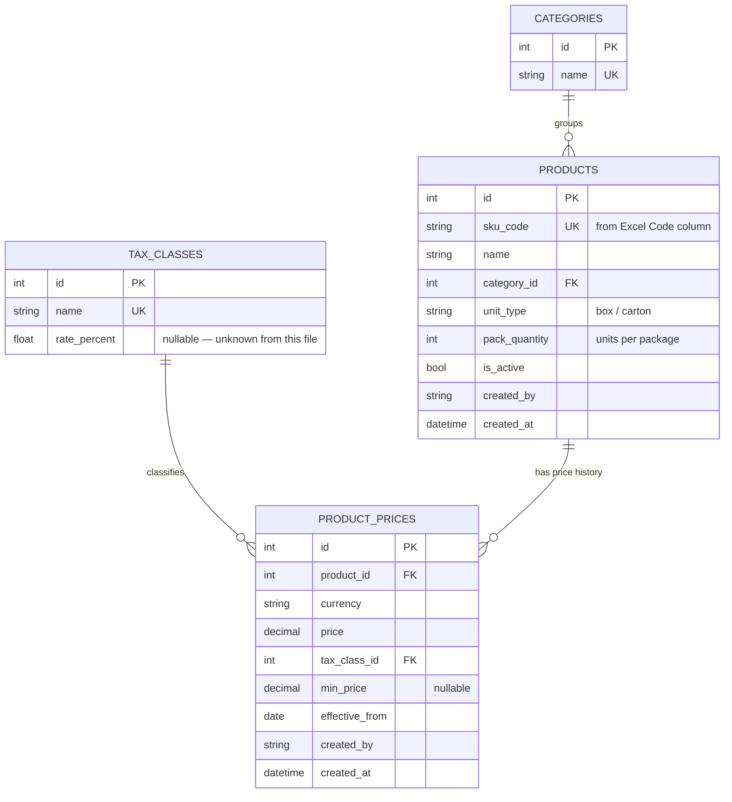

# Phase 2.5 — Real Data Validation Report

**Source file:** `new-matirial/الأسعار26.81.XLS` (legacy binary `.xls`, OLE2/CFBF format, created 2024-09-09)
**Status:** Design finalized per user decisions below (2026-07-15). Still no import performed, no Local Agent code touched — implementation awaits explicit go-ahead per this phase's rules ("wait for approval before implementing anything").

---

## 1. Dataset Analysis Report

**Structure:** 1 worksheet ("Sheet"), 93 data rows × 13 columns, plus 3 header rows (title row, group-header row, column-header row).

| # | Column (Arabic) | Meaning | Type observed | Nulls | Notes |
|---|---|---|---|---|---|
| 0 | الفئة | Category | text | 0/93 | Constant `"سكاكر "` (candy) on every row — **trailing space on all 93 rows** |
| 1 | إسم الصنف | Item name | text | 0/93 | Free text; brand+flavor+size all concatenated |
| 2 | Code | SKU code | int64 | 0/93 | 93 unique values in range 100001–100099 (99-slot range, 6 gaps) |
| 3 | ضريبة | Tax class | text | 0/93 | Constant `"Zero VAT"` on every row |
| 4 | الوحدة | Packaging unit | text | 0/93 | e.g. `"علبة* 24"` (box×24) — container type + pack count crammed into one string, **3 different spacing conventions** |
| 5 | العملة | Currency | text | 0/93 | Constant `"د.أ"` (Jordanian Dinar) |
| 6 | السعر | Price | float64 | 0/93 | Range 2.00–35.90, mean 7.01 |
| 7 | السعر + ضريبة | Price incl. tax | float64 | 0/93 | **Identical to column 6 on all 93 rows** (Zero VAT ⇒ no difference) |
| 8 | تاريخ التفعيل | Price effective/activation date | datetime | 0/93 | Constant `2024-01-01 00:00:00` on every row |
| 9 | السعر الأدنى | Minimum price | float64 | **92/93** | Populated for exactly 1 row, and that value equals the regular price anyway |
| 10 | السعر الأدنى + ضريبة | Min price incl. tax | float64 | **92/93** | Same single row as col 9 |
| 11 | أنشئ بواسطة | Created by | text | 0/93 | Constant `"ADMIN"` |
| 12 | تاريخ الإنشاء | Created at | datetime | 0/93 | All 93 rows fall in a 3.5-hour window on 2024-09-08 (19:47–23:14), in 6 tight batches — a bulk one-time data entry/import, not organic daily use |

**Duplicated information:** `price` and `price_incl_tax` are byte-for-byte identical on all 93 rows (verified programmatically — 0 mismatches), because tax is always "Zero VAT." Fully redundant *in this file*, but the column exists to support non-zero-tax categories elsewhere in the source system.

**Missing values:** only `min_price`/`min_price_incl_tax` (98.9% empty) — every other column is 100% populated.

**Inconsistent values (verified):**
- `category`: trailing whitespace on **all 93/93 rows** (`"سكاكر "` not `"سكاكر"`).
- `item_name`: leading/trailing whitespace on 30/93 rows; internal double-spaces on 66/93 rows (e.g. `"البيني  شوكولا  52غ 30% *18"`).
- `unit`: 19 distinct raw strings for what is conceptually 2 container types × a pack count — three different spacing patterns around `*` (`"علبة* 24"`, `"علبة *14"`, `"علبة*20"`).

**Possible primary key:** `code` (SKU) — verified unique across all 93 rows, no duplicates.

**Possible foreign keys (once normalized):** `category` → a categories lookup; `ضريبة` (tax class) → a tax-classes lookup; `أنشئ بواسطة` → a users/staff lookup (currently a single constant value, "ADMIN").

**Calculated fields:** `price_incl_tax` and `min_price_incl_tax` are fully derivable from `price`/`min_price` + the tax class's rate — see Schema §3 for the recommendation to not store them.

**Duplicate rows found (verified):** 2 pairs — identical `item_name` + `price` + `unit`, different `code`:
- `100003` / `100004` — "برنكلز اخضر 40غ" (green sprinkles, 40g), both priced 8.5, both `صندوق*12`
- `100023` / `100024` — "كلورتس علكة 2.8غ ميكس *65" (Clorets gum mix), both priced 2.0, both `علبة*65`

This needs a business decision (§9), not a technical fix — both could be legitimate separate SKUs (e.g. different barcodes) or a genuine data-entry duplicate.

**Code sequence gaps:** 100001–100099 is a 99-slot range; only 93 codes present. Missing: `100043, 100044, 100076, 100096, 100097, 100098`. Either these codes belong to other categories in a larger master file this export was filtered from, or they were deleted/deactivated items — cannot tell from this file alone (§9).

---

## 2. Business Domain Report

This file is a **product price list export** — almost certainly one category slice from a POS/ERP system's pricing module (the field shapes — SKU code, tax class, activation/effective date, minimum price, created-by/created-at audit fields — are a textbook "Item Price List" export, and "Zero VAT" + Jordanian Dinar currency point to a Jordan-based retail/wholesale system).

**Entities actually present in this file** (not guessing beyond what's here):
- **Product** — the core entity: name, SKU code, packaging description.
- **Category** — one value present (`سكاكر`/candy), but the column's existence implies a broader taxonomy in the source system.
- **Tax class** — one value present (`Zero VAT`), same reasoning.
- **Price** (as a first-class, time-stamped concept, not just a product attribute) — the presence of an *activation date* alongside price strongly implies the source system tracks **price history over time**, not just "current price."
- **Audit metadata** — created-by/created-at on every record.

**Entities NOT present in this file** — no customers, suppliers, invoices, inventory/stock-on-hand, payments, appointments, or employees anywhere in these 93 rows. This file only covers the product-catalog/pricing side of the business. I'm flagging this rather than assuming more data is coming (§9, Q2).

---

## 3. Proposed Database Schema

Two real options exist here, and the choice affects the currently-frozen `local-agent` `products` table — **this is a decision point, not something I'm choosing unilaterally.**

### Option A — Extend the existing `products` table
Add nullable columns (`sku_code`, `category`, `tax_class`, `unit_raw`, `currency`, `activation_date`, `min_price`, `created_by`, `created_at`) directly to the frozen `products` table.
- ✅ Smallest possible change, no new tables.
- ❌ Conflates "pack quantity" (units per box, from this Excel) with the existing `quantity` column, which in Phase 1's model means **stock on hand** — a real semantic collision, not just a naming nitpick. Importing "24" (units per box) into a column meant for "how many we have in stock" would silently corrupt any future inventory feature.
- ❌ No support for price *history* (the `activation_date` field implies prices change over time; a flat `products.price` column can only ever hold "current price").

### Option B — Two dedicated tables (recommended)
```
categories(id PK, name UNIQUE)
tax_classes(id PK, name UNIQUE, rate_percent NULLABLE)   -- rate unknown from this file, see §9 Q7
products(id PK, sku_code UNIQUE NOT NULL, name NOT NULL, category_id FK,
         unit_type, pack_quantity INTEGER, is_active BOOLEAN DEFAULT true,
         created_by, created_at)
product_prices(id PK, product_id FK, currency, price NUMERIC NOT NULL,
               tax_class_id FK, min_price NUMERIC NULLABLE,
               effective_from DATE, created_by, created_at,
               UNIQUE(product_id, effective_from))
```
- ✅ Separates "what a product *is*" from "what it currently/historically *costs*" — matches the activation-date field's implied meaning and supports real price-change tracking later.
- ✅ `unit` split into `unit_type` (box/carton) + `pack_quantity` (integer) instead of a free-text string with 3 spacing conventions — makes "show me everything packed 24-per-box" a real query instead of a regex.
- ✅ Does **not** touch the existing `quantity` (stock) column's meaning at all — `pack_quantity` lives on `products`, stock-on-hand stays untouched and unambiguous.
- **Recommended simplification:** don't store `price_incl_tax`/`min_price_incl_tax` at all — verified 0 mismatches between `price` and `price_incl_tax` in this file (Zero VAT ⇒ identical); compute `price × (1 + tax_classes.rate_percent)` on read instead of storing a value that can drift out of sync. Requires knowing the actual rate for non-zero tax classes, which this file doesn't contain (§9 Q7).
- **Recommended simplification:** skip a dedicated index on `categories.name`/`tax_classes.name` — with only 1 distinct value each in real data so far, an index adds nothing measurable yet.

**Constraints:** `products.sku_code` UNIQUE NOT NULL · `products.name` NOT NULL · `product_prices.price >= 0` · `products.pack_quantity > 0` · `UNIQUE(product_id, effective_from)` on `product_prices` to prevent two "current" prices for the same date.

**This does not violate "no redesign"** — nothing here touches the Agent/Tools/Services/Plugin Manager/Plugin code layering (already frozen and unaffected); this is entirely a data-shape proposal for whichever plugin ultimately owns it.

---

## 4. Entity Relationship Diagram



---

## 5. Excel → Database Mapping

| Excel Column | → | Table | Column | Transformation |
|---|---|---|---|---|
| الفئة (Category) | → | `categories` | `name` | trim trailing whitespace; lookup-or-create |
| إسم الصنف (Item name) | → | `products` | `name` | trim + collapse repeated internal spaces |
| Code | → | `products` | `sku_code` | direct (store as text, not int — safer for a SKU even though currently numeric) |
| ضريبة (Tax) | → | `tax_classes` | `name` | lookup-or-create (`"Zero VAT"`) |
| الوحدة (Unit) | → | `products` | `unit_type` + `pack_quantity` | **split required**: regex-parse `"علبة* 24"` → `unit_type="علبة"`, `pack_quantity=24`, tolerant of all 3 observed spacing patterns |
| العملة (Currency) | → | `product_prices` | `currency` | direct |
| السعر (Price) | → | `product_prices` | `price` | direct, cast to Decimal |
| السعر + ضريبة (Price+Tax) | → | *(not stored)* | — | dropped as derivable — see §3 |
| تاريخ التفعيل (Activation date) | → | `product_prices` | `effective_from` | direct |
| السعر الأدنى (Min price) | → | `product_prices` | `min_price` | direct (will be NULL for 92/93 rows) |
| السعر الأدنى + ضريبة | → | *(not stored)* | — | dropped as derivable — see §3 |
| أنشئ بواسطة (Created by) | → | `products` + `product_prices` | `created_by` | direct, copied to both |
| تاريخ الإنشاء (Created at) | → | `products` + `product_prices` | `created_at` | direct, copied to both |

Every column maps somewhere — nothing silently discarded; the two dropped columns have an explicit derivation reason stated above.

---

## 6. Data Validation Report

| Check | Result |
|---|---|
| Duplicates (exact code) | ✅ None — 93/93 unique |
| Duplicates (name+price+unit, different code) | ⚠️ 2 pairs found — see §1, needs a business decision (§9 Q3) |
| Invalid dates | ✅ None — both date columns parse cleanly |
| Invalid numbers | ✅ None — `price` always numeric and positive |
| Empty required fields | ✅ None — category/name/code/price/unit are 100% populated |
| Broken references | N/A — no FKs exist yet in the flat file; once `category`/`tax` are normalized, the verified trailing-whitespace issue (§1) must be trimmed *before* using them as lookup keys, or duplicate category/tax rows would be created |
| Inconsistent IDs | ✅ `code` is clean; 6 sequence gaps noted (§1), not an error, needs context (§9 Q1) |
| Formatting inconsistencies | ⚠️ Verified: trailing whitespace on `category` (93/93 rows), whitespace/double-spacing on `item_name` (30/93, 66/93), 3 spacing conventions in `unit` |

**Verdict: data quality is good.** No missing required fields, no invalid types, no broken numeric logic (price/price+tax relationship holds exactly everywhere it should). Every issue found is a **formatting/normalization** problem with a known fix, plus 2 rows needing a human decision — not a data-integrity failure.

---

## 7. Import Strategy (proposal only — not to be executed without approval, per this phase's Step 6)

Once schema (§3) and validation (§6) are approved:
1. **Incremental, upsert-by-`sku_code`** — never delete; each import batch either inserts a new product/price or updates an existing one keyed on `sku_code`.
2. **Dry-run first** — run the full mapping + validation against the file and report exactly what *would* be inserted/updated, write nothing.
3. **Batch-tagged import** — every row written in one import run gets a shared `import_batch_id`, enabling a full rollback (`DELETE WHERE import_batch_id = X`) if something's wrong after the fact.
4. **New Local Agent tools required** (per "propose them first, do not implement without approval"): this import path does not fit the existing 6 tools (`create_customer`, `list_customers`, `create_product`, `list_products`, `create_invoice`, `list_invoices`) — it would need a new tool, e.g. `import_price_catalog(file_path)`, added the same way every other tool is (schema in `ai/tools/schemas.py` + handler in `ai/tools/registry.py` + a new `services/catalog_import_service.py`), going through `plugin_manager.execute()` like everything else. **Not building this yet** — flagging that it's needed, per instructions.

---

## 8. Risks

- **Schema mismatch:** real data is materially richer than the frozen `products` table. Importing naively either loses data or requires the approved schema change in §3.
- **`quantity` field collision:** the Excel's pack-multiplier ("units per box") must never be written into the existing `quantity` column, which means stock-on-hand in Phase 1's model — a real semantic corruption risk if not kept separate (Option B avoids this entirely).
- **Partial catalog:** this file is very likely one category slice of a larger master price list (6 SKU-code gaps outside this category's own numbering), not the whole business — treating it as "the entire catalog" would misrepresent what the business actually sells.
- **Unresolved duplicates:** the 2 identical-looking pairs (§1) need a decision before any import, or the same product could be double-counted.
- **No VAT rate on file:** "Zero VAT" is confirmed as 0% by the data itself, but no numeric rate exists anywhere for a hypothetical non-zero tax class — the derived-column approach in §3 needs that rate supplied separately if/when a non-zero-tax file appears.

---

## 9. Questions Requiring Clarification

1. Is `الأسعار26.81.XLS` **one category slice** of a larger multi-category master price list, or is candy (`سكاكر`) this business's entire catalog? (The 6 SKU-code gaps suggest other categories may exist elsewhere.)
2. Will you be providing additional files/sheets for **customers, suppliers, invoices, or stock/inventory levels**? This file only covers products + pricing — none of the other business entities exist here.
3. For the 2 exact-duplicate `(name, price, unit)` pairs with different codes — are both genuinely separate SKUs to keep, or is one a data-entry duplicate to exclude?
4. Should this real data **replace** the Local Agent's existing `products` table (requiring the Option B schema change approved above), or live in a **new, separate reference table** alongside the current simple product tools, leaving the frozen Phase 1 schema untouched? This determines the entire import path.
5. `السعر الأدنى` (minimum price) is populated for only 1 of 93 rows, and that value equals the regular price — is this a meaningful "floor price" business rule the agent should ever enforce, or incidental/unused data from the source system?
6. Should `الوحدة` (unit) be split into structured `unit_type` + `pack_quantity` (recommended, §3), or kept as a single free-text field exactly as the source system stores it?
7. What does `تاريخ التفعيل` (activation date) actually mean in the source system — genuinely "when this price took effect" (all 93 rows show the identical value `2024-01-01`, which is suspicious for a true per-row historical field), or a default/placeholder stamped by the export tool itself?

**Waiting for your answers/approval before any schema change, tool proposal, or import is implemented.**

---

## 10. Decisions (2026-07-15) — Supersedes §3–§9 above

Answers received for all 7 questions, plus one architectural directive that changes the recommendation in §3.

| Q | Decision |
|---|---|
| 1. Partial catalog? | Assume yes — one export among possibly many. Design must support importing additional catalogs later **without schema changes**. |
| 2. More entities coming? | Yes — customers, suppliers, invoices, inventory, POS exports in later phases. Design with that in mind; **do not build those entities now**. |
| 3. Duplicates | **Never auto-deduplicate.** Treat duplicate SKUs as valid business records until proven otherwise. Report only, require human confirmation to ever remove one. |
| 4. Touch `products`? | **No.** Frozen schema stays untouched. Import goes into a new, separate reference table instead — decoupled from operational/runtime data. |
| 5. Min price | Optional. Store if present. **Do not enforce** as a business rule yet. |
| 6. Split `unit`? | **No, not yet.** Keep as one raw string. Revisit splitting into `unit_type`/`pack_quantity` only if future files show enough varied formats (`24 Bottle`, `12 Pack`, `6 Box`...) to justify it — no premature complexity. |
| 7. Activation date | Treat as **metadata only**. Do not build price-history logic until future datasets actually demonstrate real historical pricing. |
| **Architectural directive** | **Imported business data is an external reference source, not the operational database.** It must stay decoupled from runtime entities (`products`, `customers`, `invoices`, ...) until the business's full workflows and future file types are understood. No operational schema changes based on a single import file — the first Excel a client sends must never dictate the shape of the live database. |

### Revised Schema (replaces §3's Option B)

One flat, generic reference table — deliberately *not* normalized into `categories`/`tax_classes` lookups, and *not* split into `products`/`product_prices`, per decisions 4, 6, 7, and the architectural directive. Storing the source data close to as-given (not deriving/dropping columns) keeps this layer a neutral mirror rather than a place where business rules (e.g. a VAT rate) get silently baked in.

```sql
CREATE TABLE import_batches (
    id            TEXT PRIMARY KEY,     -- UUID, groups every row from one import run
    source_file   TEXT NOT NULL,        -- e.g. "الأسعار26.81.XLS" — supports many future files
    imported_at   TEXT NOT NULL,
    row_count     INTEGER NOT NULL,
    status        TEXT NOT NULL         -- "dry_run" | "committed" | "rolled_back"
);

CREATE TABLE product_catalog (
    id                INTEGER PRIMARY KEY AUTOINCREMENT,
    import_batch_id   TEXT NOT NULL REFERENCES import_batches(id),
    category          TEXT,             -- raw, whitespace-trimmed only
    name              TEXT NOT NULL,    -- raw, whitespace-trimmed/collapsed only
    sku_code          TEXT,             -- nullable: future catalogs may not have one
    tax_class         TEXT,
    unit              TEXT,             -- kept as single raw string, per decision 6
    currency          TEXT,
    price             NUMERIC,
    price_incl_tax    NUMERIC,          -- stored as-given, not derived (neutral mirror)
    min_price         NUMERIC,          -- stored if present, not enforced (decision 5)
    min_price_incl_tax NUMERIC,
    activation_date   TEXT,             -- metadata only, no history logic (decision 7)
    source_created_by TEXT,             -- from the source system's own audit fields
    source_created_at TEXT
);
```

No foreign keys into `products`/`customers`/`invoices` — `product_catalog` is intentionally an island. Any future file (customers, invoices, a different product category, a different POS export) gets its own same-shaped `*_batches` row + its own reference table when that phase actually arrives, rather than forcing every future file into today's guesses.

**Duplicate handling:** no unique constraint on `sku_code` in this table (decision 3 — duplicates are valid until proven otherwise). A read-only "possible duplicates" query (same `name`+`price`+`unit`, different `sku_code`) can be run for reporting, but nothing is ever auto-removed.

### Revised Mapping

Same 13 source columns, now mapped 1:1 onto `product_catalog` with only whitespace-normalization (no splitting, no dropping, no deriving) — `unit` stays whole, `price_incl_tax`/`min_price_incl_tax` are stored rather than dropped, `activation_date`/`created_by`/`created_at` are stored as plain metadata columns with no historical-tracking semantics attached.

### New Plugin Actions Required (proposed, not built)

Per "propose new import tools first, do not implement without approval": this needs a new, separate action namespace, decoupled from the existing 6 product/customer/invoice tools — matching the architectural directive that imported reference data shouldn't share a path with runtime operational data.
- `services/catalog_import_service.py` — new service: parses an Excel file, normalizes whitespace only, writes to `import_batches` + `product_catalog` via `plugin_manager.execute()`.
- New plugin actions on the active plugin (e.g. `plugins/sqlite/plugin.py`'s `_ACTIONS`): `import_catalog_batch`, `list_catalog_batches`, `search_catalog`.
- New LLM-facing tools in `ai/tools/schemas.py`: e.g. `search_product_catalog(query)` — read-only, lets the agent answer "what's the price of X" from imported reference data without ever writing to `products`.

### Revised Risks (supersedes §8)

- ~~Schema mismatch with frozen `products` table~~ — resolved by decision 4 (separate table, no touch to `products`).
- ~~`quantity` collision~~ — resolved, `product_catalog` has no `quantity` column at all.
- **New risk:** `product_catalog` and `products` can now legitimately disagree (e.g. the catalog says a product exists at price X, but no matching row exists in `products` yet) — expected and fine per the architectural directive, but means any future "search for a product" agent behavior must be explicit about which table it's answering from, so the user isn't confused about whether a catalog hit means the product is actually sellable today.
- Still open: partial-catalog risk (decision 1 assumes yes, doesn't resolve *how* future catalogs will be told apart — `source_file` on `import_batches` handles this structurally).
- Still open: 2 unresolved duplicate pairs — no longer a blocker (decision 3: import both, report only).

---

## 11. Status

Design finalized per the decisions above, then **approved and implemented** on 2026-07-15 — see §12.

---

## 12. Implementation (2026-07-15)

Approved revision applied: `import_batches` built **shared** (with an `entity_type` column) rather than product-catalog-specific; `catalog_import_service.py` built **concrete**, not a generic Import Engine. The abstraction rule this follows is now a standing project rule — see `.claude/rules/team-roles.md`'s Architecture Guardian section.

**Files added/changed** (isolated to the import capability — no other layer touched):
- `database/migrations/schema.sql` + `schema_postgres.sql` — added `import_batches` (shared) and `product_catalog` (concrete) tables
- `database/models/import_batch.py`, `database/models/catalog_item.py` — new Pydantic models
- `plugins/sqlite/plugin.py`, `plugins/postgres/plugin.py` — 4 new actions each, kept at parity: `commit_product_catalog_import`, `list_import_batches`, `search_product_catalog`, `rollback_import_batch`
- `services/catalog_import_service.py` — new, concrete: Excel parsing (`.xls` via `xlrd`, `.xlsx` via `openpyxl`), whitespace-only normalization, duplicate reporting (never filtering), orchestration via `plugin_manager.execute()`
- `requirements.txt` — added `xlrd`, `openpyxl`
- `ai/tools/schemas.py` + `ai/tools/registry.py` — 4 new LLM tools: `preview_catalog_import`, `import_product_catalog`, `search_product_catalog`, `list_catalog_imports`. `rollback_import_batch` deliberately **not** exposed to the LLM (destructive; service-level only for now).
- `ai/prompts/system.md` — one sentence added noting the catalog-import capability exists.

**Verified scenarios** (all against the real file, real SQLite DB — not mocked, except the LLM tool-selection step which used a realistic mock as in Phase 2):

| # | Scenario | Result |
|---|---|---|
| 1 | Migrations create the 2 new tables alongside the 3 existing ones | `import_batches`, `product_catalog` present via both direct migration call and real `POST /agent/setup` |
| 2 | Preview (dry run) of the real 93-row file | Correct row count, correct whitespace-normalized sample, **5 duplicate pairs found** (whitespace normalization caught 3 more than the raw-string check in §1 — e.g. `"غندور  اونيكا"` vs `"غندور اونيكا"` now correctly recognized as the same name) |
| 3 | Commit import of the real file | 1 batch row + 93 `product_catalog` rows created atomically; `products` table verified still at 0 rows — completely untouched |
| 4 | Both rows of a duplicate pair present after import | Confirmed `100003`/`100004` both stored, identical name/price, decision 3 honored |
| 5 | `search_product_catalog` | Real substring search against imported data, correct results (e.g. "كيت كات" → 2 real matches) |
| 6 | Full agent chain (mocked LLM tool-call → registry → service → plugin_manager → sqlite plugin → DB → event log) | Verified for `search_product_catalog`; event log recorded `status="success"` with full result detail, same as every other tool |
| 7 | Rollback | Deletes the batch's `product_catalog` rows, marks batch `rolled_back`; verified `product_catalog` back to 0 rows |
| 8 | Rollback safety checks | Re-rolling-back an already-rolled-back batch → clean error; rolling back an unknown batch id → clean error |
| 9 | Real HTTP round-trip | `POST /agent/setup` over actual HTTP creates all 5 tables correctly |

Postgres plugin parity (§ implementation) was written to the identical action set and reviewed for correctness, but not live-tested — no Postgres server available in this environment (same limitation as the rest of Phase 1/2).

All test data (venv, `storage/local.db`, `logs/events.log`) cleaned up after verification, consistent with every prior verification pass this project.
